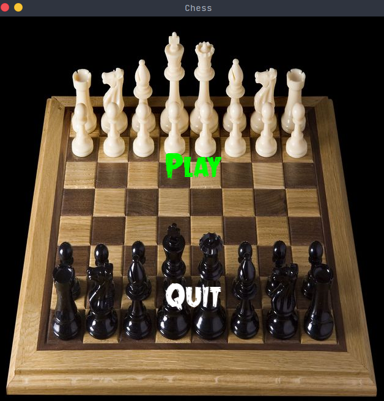
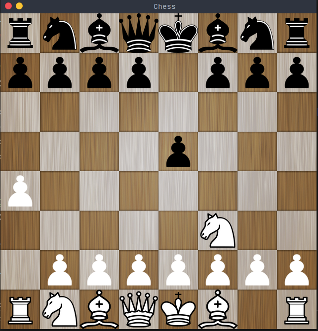

# sfml_chess

<!-- ABOUT THE PROJECT -->
## About The Project

Project of 10th grade that i had to do, making a game with assembly.
I made TicTacToe game but also tried to do Snake and in the end i chose Snake 
to be the project that will be graded

### Built With

c++ and sfml

<!-- GETTING STARTED -->
## Getting Started
g++ -o main.cpp main.cpp -o sfml-game -lsfml-graphics -lsfml-window -lsfml-system

### Example

### Prerequisites

c++ compiler and sfml library

## License

Distributed under the MIT License. See `LICENSE` for more information.

